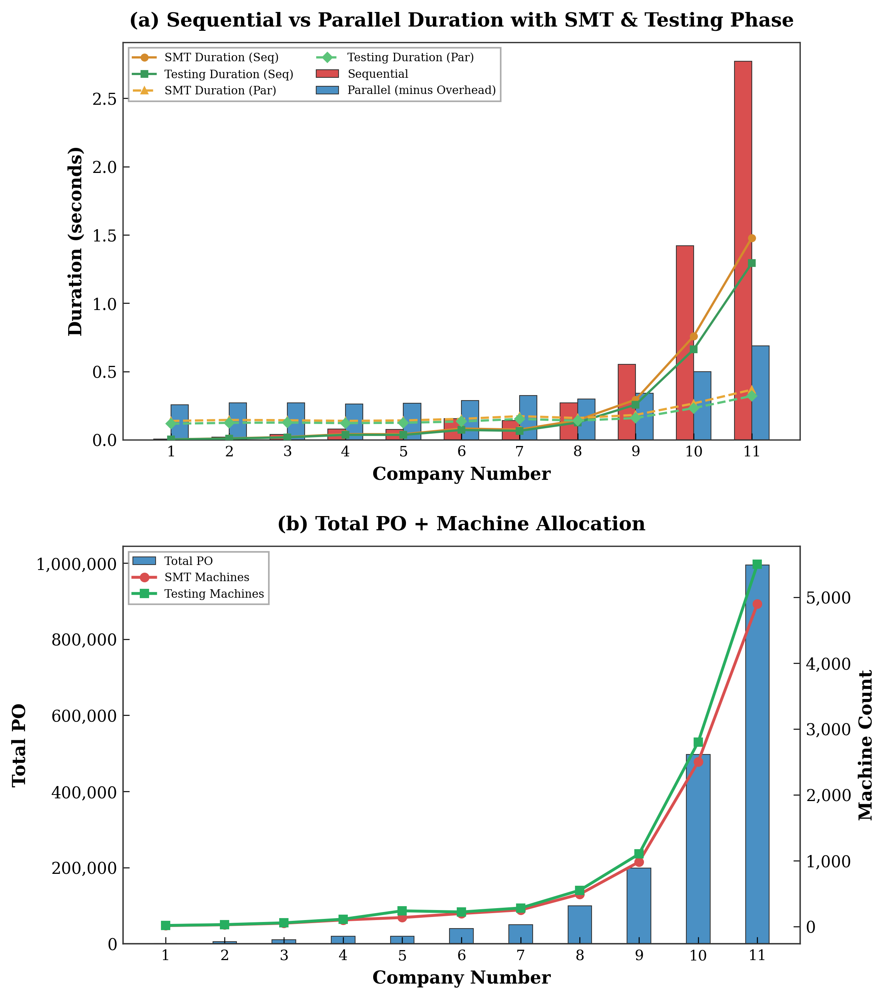

## Manufacturing Flow Simulation: High-Performance Computing (HPC) and Job Shop Scheduling (JSS) Analysis

This prototype is a simulation of an electronics manufacturing process. Featuring : 
1. Computational complexity introduced by Job Shop Scheduling (JSS) in SMT and Testing phases. 
2. Comparing performance of sequential vs parallel execution (HPC).

### Overall Manufacture Flow and Data Generation

**The Pipeline:**
1. **Received Purchase Order (PO)**: PO contain, product/material, quantity, etc.
2. **DFM (Design for Manufacturing)**: Engineering validation of the PO.
3. **SMT (Surface Mount Technology)**: High-complexity JSS phase where components are placed on PCBs. (Different Product, Different BOM, Different Process)
4. **Manual Assembly**: Human-in-the-loop assembly components.
5. **Testing**: High-complexity JSS phase for functional and reliability verification.
6. **Quality Check**: Final product containerization.
7. **Etc**: Related to logistics, shipment, etc.

### Data Multiplication Factor
The simulation demonstrates an exponential growth in data rows relative to the initial PO count. For instance, roughly **1,000 POs** generate approximately **5 Million rows** of manufacturing data, as each PO is decomposed into specific machine instructions and state logs.

### JSS Complexity: SMT and Testing Phases
The most computationally intensive steps are **Step 3 (SMT)** and **Step 5 (Testing)**. These steps implement a **Job Shop Scheduling (JSS)** algorithm.

**Complexity Drivers :** 
- **Random Mapping**: Each board is assigned to available machines based on a randomized mapping logic
- **Machine Combinations**: As the number of machines increases, the matrix of potential scheduling combinations grows.
- **Sequence Dependencies**: Durations are not fixed, they depend on the specific machine assigned and the existing queue

Analysis of the raw simulation data reveals how machine allocation affects complexity:
```
- Scenario 4: 20,000 POs | 98 SMT Machines | 110 Testing Machines -> Total New Rows: ~103.8M.
- Scenario 5: 20,000 POs | 135 SMT Machines | 237 Testing Machines -> Total New Rows: ~103.8M.
```
Despite nearly identical PO and row counts, Scenario 5 involves a much larger machine pool. In the JSS algorithm, this results in a wider search space for "Random Mapping," which impacts the simulation's state management and execution duration.

### Performance Analysis
The following chart visualizes the comparison between Sequential and Parallel execution across different company scales.




| Scenario | Total PO | Total New Rows | Sequential (s) | Parallel (minus Overhead) (s) |
| :--- | :--- | :--- | :--- | :--- |
| **8** | 99,524 | 520,679,784 | 0.269s | 0.299s |
| **9** | 198,996 | 1,039,315,179 | 0.551s | 0.341s |
| **11** | 994,901 | 5,204,071,024 | 2.771s | 0.687s |

Turning point at 50.000+ POs : 
- **Small Scale (< 50,000 PO)**: Sequential execution is generally faster due to the absence of parallel overhead.
- **HPC Scaling (50,000+ PO)**: The benefits of distributing the JSS workload across multiple cores begin to outweigh the overhead.
- **High Volume (200,000+ PO)**: Parallel execution demonstrates superior scaling, reducing execution time by over **75%** in massive datasets

### System Workflow and Code Architecture
The prototype is structured into three primary modules:

1. **`manufacture_flow.py`**: The core engine. 
   - Implements the `ParallelSim` class for HPC execution.
   - Contains the JSS logic and data generation loops.
   - Outputs `manufacture_flow_result.json`.
2. **`config.json` & `config_old.json`**: Scenario definition files.
   - Define machine counts, PO volumes, and scenario identifiers.
3. **`manufacture_flow_chart.py`**: Visualization layer.
   - Processes JSON results into journal-quality plots using Matplotlib and LaTeX-style styling.